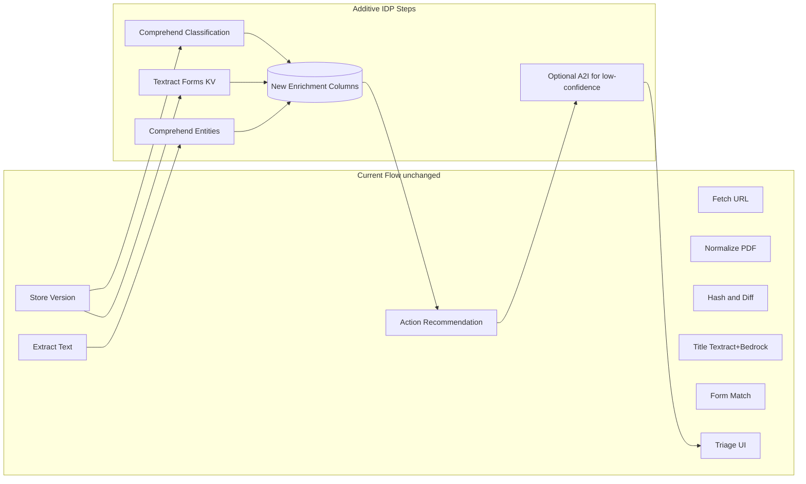

# Additional AWS Features for Forms Workflow (Additive Only)

This plan catalogs **additional** capabilities from AWS Comprehend, Textract, Lambda, and Intelligent Document Processing (IDP) that align with the PoC Solution Design Document v1 Forms Workflow. The codebase already references REQ-001, REQ-003, REQ-004, REQ-006, REQ-009, REQ-013, REQ-014, PoC Section 5 (metrics), and test scenarios (e.g., TEST-02). All proposals below **add** new behavior or enrichment; existing behavior (Lambda scraper, Textract OCR fallback, Textract+Bedrock title extraction, form matching, action recommendations, triage, metrics) stays as-is.

---

## 1. Amazon Comprehend (Additive)

**Current use:** None.

**Additive features that align with the PoC:**

- **Document classification**  

Classify each form PDF into types (e.g., motion, petition, cover sheet, order) using Comprehend’s document classifier. Output can feed:

  - Triage/action logic (e.g., “motion” vs “cover sheet” routing).
  - Metrics (e.g., counts by form type in [services/metrics_tracker.py](services/metrics_tracker.py)).
  - Classification override (REQ-004) as an extra signal before human override.

- **Entity extraction (NER) on extracted text**  

Run Comprehend NER on the text already produced by [pdf_processing/text_extractor.py](pdf_processing/text_extractor.py) or [pdf_processing/ocr_fallback.py](pdf_processing/ocr_fallback.py) to pull out:

  - Dates (supplement [REQ-006](services/title_extractor.py) revision-date extraction).
  - Party/case names, jurisdictions, form numbers (to support [services/form_matcher.py](services/form_matcher.py) and form-number matching).
  - Org/location entities for filters or reporting.

- **PII detection and redaction**  

For stored text or UI previews (e.g., diff views, search snippets), use Comprehend PII detection and redaction so reviewers see redacted versions when appropriate. Complements existing triage (REQ-013, REQ-014) without changing core logic.

- **Custom entity recognizer**  

Train a custom NER model on court-form terminology (form numbers, document types, jurisdictions). Use it as an **additional** signal alongside current form-number regex and [services/form_matcher.py](services/form_matcher.py) to improve “New Form” vs “Updated Form (Same Name)” vs “Updated Form (Name Change)” (PoC Step 3).

- **One-step classification on native PDFs**  

Use Comprehend’s native-PDF classification so classification can run directly on the fetched PDF (or first page) as an **extra** enrichment path, without replacing existing text extraction or title pipeline.

**Integration points (additive only):**

New optional Comprehend calls **after** existing extraction; results stored in new columns or side tables (e.g., `document_type`, `extracted_entities`, `pii_redacted_text`) and used by triage, metrics, and form-matching as additional inputs.

---

## 2. Amazon Textract (Beyond Current OCR + Title Use)

**Current use:**

- [pdf_processing/ocr_fallback.py](pdf_processing/ocr_fallback.py): `DetectDocumentText` when text is insufficient.  
- [services/title_extractor.py](services/title_extractor.py): `DetectDocumentText` on first-page image for title/form number, then Bedrock.

**Additive features:**

- **AnalyzeDocument with FORMS**  

Use `FeatureTypes: ['FORMS']` to get key-value pairs. Extract fields such as “Form Number”, “Revision Date”, “Title” directly from structure. Use as an **additional** source for:

  - Form number and revision date (REQ-006, PoC title format).
  - Validation of Bedrock-derived title/form number.

Store structured key-value JSON per version; keep current Textract+Bedrock title path as primary or fallback.

- **AnalyzeDocument with TABLES**  

For forms that use tables (schedules, grids), extract table structure and contents. Enables:

  - Richer diff summaries (“table on page 2 changed”).
  - Optional table-level hashing for change detection, **in addition to** existing text/hash logic in [diffing/](diffing/).

- **Queries API**  

Use Textract Queries with prompts like “What is the form number?” or “What is the revision date?” to get targeted answers and confidence. Use as an **extra** input for REQ-006 and title/form-number, without replacing current Textract+Bedrock flow.

- **Signature detection**  

Use Textract signature detection for forms that require signatures. Add optional metadata (e.g., “signature present on page X”) for audit/compliance and triage, without changing core change detection.

**Integration points:**

New, optional AnalyzeDocument/Queries path(s) triggered after fetch/normalize (e.g., in the same pipeline as title extraction). Results stored as optional fields (`form_kv_pairs`, `tables_json`, `queries_answers`, `signature_pages`); existing OCR fallback and title pipeline remain unchanged.

---

## 3. AWS Lambda (Additive Orchestration and Events)

**Current use:**

- [fetcher/aws_web_scraper.py](fetcher/aws_web_scraper.py): Lambda invokes a scraper function for JS-rendered pages and PDF link extraction.

**Additive features:**

- **Event-driven monitoring**  

EventBridge rule → Lambda that calls the same monitoring logic as `cli.py run` (or an HTTP trigger to the app). Keeps cron/CLI as-is and **adds** a serverless schedule option.

- **Enrichment pipeline Lambda**  

A separate Lambda that runs after a “new version” is stored: chain Textract (Forms/Queries), Comprehend (classification/entities), and optionally Bedrock. Writes results into new columns/tables. The main app continues to run its current pipeline; this Lambda runs as an **async enrichment** path (e.g., triggered by DB event, queue, or S3 drop).

- **S3-based ingestion**  

Optional path: upload PDFs to S3 → S3 event → Lambda → run existing processing (normalize, extract, hash, store). Keeps URL-based monitoring and CLI as the primary flow and adds S3 as an **additional** ingestion source.

- **Webhooks / external integrations**  

API Gateway + Lambda to receive “form changed” or “new form” callbacks from external systems, then invoke existing APIs (e.g., `/api/monitor/run` or triage endpoints). Leaves current API and triage behavior unchanged.

**Integration points:**

New Lambda(s) and optional EventBridge/S3/API Gateway config; no changes to [cli.py](cli.py) orchestration or [fetcher/](fetcher/) logic except optional “call enrichment Lambda” or “publish to S3” steps.

---

## 4. Intelligent Document Processing (IDP) as an Additive Pattern

**Current flow:**

Fetch → normalize → extract text (pdfplumber/pdfminer/Textract OCR) → hash/diff → store → optional title (Textract+Bedrock) → form match → action recommendation → triage.

**Additive IDP-style pipeline** (each step is an **addition**, not a replacement):

- **Classification:** Comprehend document type → new field used in triage/metrics.  
- **Structured extraction:** Textract Forms/Queries → form number, revision date, key fields; feed REQ-006 and title validation.  
- **Entity enrichment:** Comprehend NER on extracted text → dates, parties, jurisdictions; feed form matching and metrics.  
- **Optional A2I:** For items with action_confidence below a threshold (REQ-001/REQ-003), send to Amazon A2I for human review; results feed back into the same triage/override flow (REQ-013, REQ-014).  

All of this sits **on top of** the current flow; nothing is removed or replaced.

---

## 5. Alignment to PoC Requirements (Summary)

| PoC Element | Additive AWS Feature |

|-------------|----------------------|

| REQ-001, REQ-003, REQ-009 (action recommendation) | Comprehend class + entity signals; optional A2I for low-confidence cases. |

| REQ-004 (classification override) | Comprehend document type as extra AI classification source before override. |

| REQ-006 (revision date) | Textract Forms/Queries + Comprehend NER as extra sources besides regex in [title_extractor](services/title_extractor.py). |

| REQ-013, REQ-014 (triage/review) | A2I as optional human-review path for “manual_required” / low-confidence items. |

| PoC Section 5 (metrics) | Comprehend document-type and entity stats in [metrics_tracker](services/metrics_tracker.py). |

| PoC Step 3 (form classification) | Comprehend custom NER + Textract Forms to improve “New Form” vs “Updated (Same Name)” vs “Updated (Name Change)”. |

| TEST-02–style (format-only, no action) | No change; new features used only when useful (e.g., enrichment), not to alter “false_positive” / format-only behavior. |

---

## 6. Implementation Notes (Additive Only)

- **Feature flags / config:** Each new AWS feature (Comprehend, Textract Forms/Queries, Lambda enrichment, A2I) should be opt-in via config so current behavior is unchanged when disabled.  
- **New schema only:** New columns or tables for classification, key-value pairs, entities, PII-redacted text, etc. Existing [db/models.py](db/models.py) columns and relationships stay.  
- **Backward compatibility:** All new logic should treat “missing enrichment” as non-fatal and optional; current form matching, action recommender, and triage continue to work with existing data.  
- **Cost and permissions:** Enabling each service (Comprehend, Textract AnalyzeDocument/Queries, Lambda, A2I) will add cost and IAM permissions; document this in runbooks or env.example only, without modifying existing minimum-required permissions for the current app.

---

## 7. Suggested Order of Work (If Implementing)

1. **Textract Forms/Queries** – Highest alignment with REQ-006 and title/form-number; natural extension of current Textract use.  
2. **Comprehend classification + NER** – Supports REQ-004, triage, and metrics with minimal change to existing pipelines.  
3. **Lambda event-driven run and optional enrichment Lambda** – Adds deployment and scaling options without changing core logic.  
4. **PII detection/redaction and A2I** – Compliance and review-quality improvements on top of existing triage.

This plan confines itself to **additional** features from AWS Comprehend, Textract, Lambda, and IDP that fit the PoC Forms Workflow; it does not change or remove any current behavior.